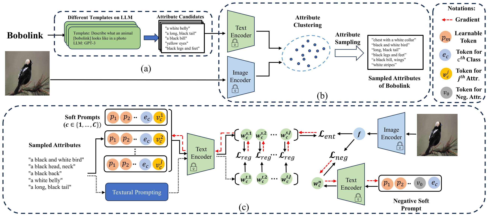
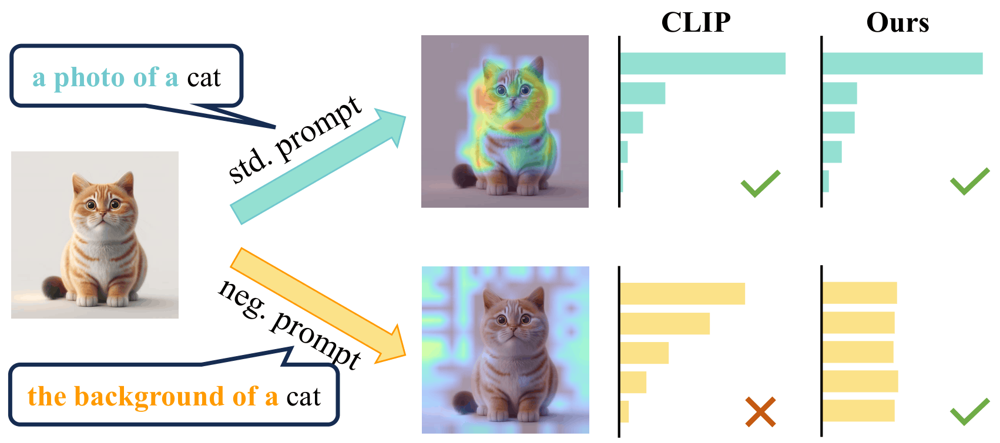
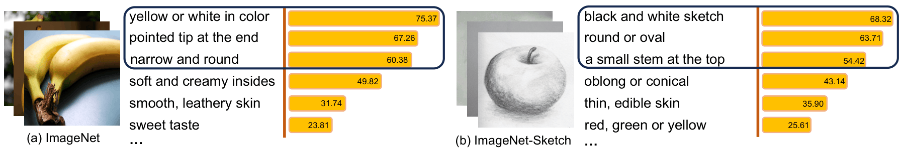
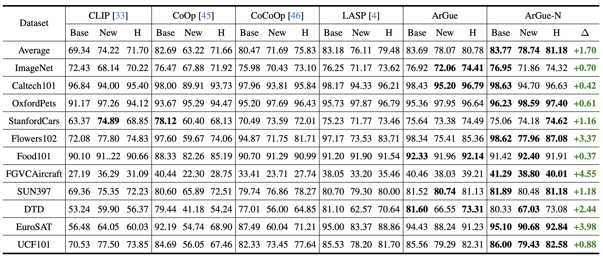
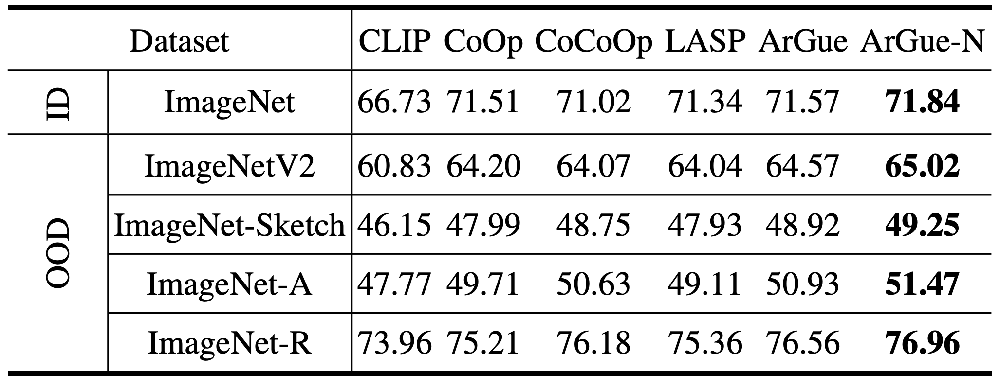
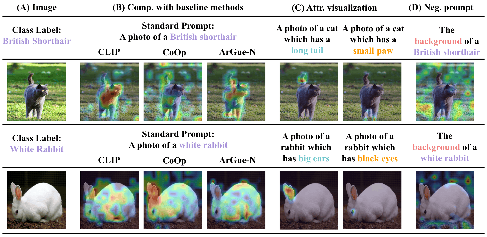

<div align="center">

# **ArGue: Attribute-Guided Prompt Tuning for Vision-Language Models (CVPR 2024)**

</div>

<p align="center"><i>ArGue addresses distribution shift limitations in soft prompt tuning by aligning Vision-Language models with LLM-generated visual attributes, introducing attribute sampling and negative prompting to suppress spurious correlations.</i></p>

<div align="center">

[](https://xytian1008.github.io/ArGue/)
[](https://arxiv.org/abs/2311.16494)
[](https://github.com/xytian1008/ArGue)

</div>

This is the official implementation of the paper *'ArGue: Attribute-Guided Prompt Tuning for Vision-Language Models'*, accepted at **CVPR 2024**.

# News📰

* **`[2024/06/01]`:** 🔥 **We have released our code.**
* **`[2024/02/27]`:** 🎉 **Our paper has been accepted to CVPR 2024!**
* **`[2023/11/28]`:** 🔥 **We have released our paper [[arXiv](https://arxiv.org/abs/2311.16494)].**

# Methodology📖

## Overview



ArGue consists of three key components built on top of soft prompt tuning:

1. **Attribute-Guided Prompting**: Instead of `[soft tokens] + [class name]`, we concatenate a visual attribute appended after the class name: `[soft tokens] + [class name] + [attribute]`. Attributes are generated by GPT-3 using multiple in-context-learning templates (J=15 per class). The final prediction averages logits over all attributes per class.

2. **Attribute Sampling**: The attribute pool is clustered in CLIP's text feature space. Within each cluster, the attribute with the highest similarity to training images is selected — filtering out non-visual (e.g., *edible*) and domain-irrelevant (e.g., color attributes for grayscale sketch datasets) attributes. Only N=3 representative attributes per class are kept for training.

3. **Negative Prompting (ArGue-N)**: A negative prompt `[soft tokens] + ["background of"] + [class name]` is constructed. Training enforces a uniform predictive distribution under this prompt (maximizing entropy), suppressing background spurious correlations without requiring per-class manual annotation.

## Negative Prompting Illustration



When given a background-activating prompt (e.g., *the background of a cat*), vanilla CLIP produces biased predictions. ArGue-N is trained to output a uniform distribution under such prompts, forcing the model to focus on class-specific attributes rather than background cues.

## Attribute Sampling



LLM-generated attributes vary in their visual relevance. Attribute sampling clusters the pool semantically and selects the attribute most aligned with actual images per cluster — retaining 20% of attributes while improving accuracy.

# Main Results🗒️

## Novel Class Prediction



ArGue-N outperforms LASP (previous state-of-the-art) by **+1.70%** on average harmonic mean across 11 datasets. It is the first prompt tuning method to surpass zero-shot CLIP on novel class accuracy in **10 out of 11** benchmarks.

## Out-of-Distribution Generalization



ArGue-N consistently outperforms all baselines across all four OOD variants of ImageNet, with notable gains on ImageNet-A (+1.47%) and ImageNet-Sketch (+0.50%).

## Component Analysis



Each component contributes incrementally. Introducing attributes alone improves CoOp by +7.64% on average. Attribute sampling further adds +0.34% while cutting 80% of computation. Negative prompting brings an additional +0.40% with no extra manual annotation.

# Getting Started🚀

## Installation

**Requirements:** Python ≥ 3.7, CUDA-compatible GPU, `torch`, `dassl`, `clip`.

```bash
git clone https://github.com/xytian1008/ArGue.git
cd ArGue
pip install -r requirements.txt
```

Install [Dassl](https://github.com/KaiyangZhou/Dassl.pytorch) following the official instructions.

## Dataset Preparation

Download datasets following [CoOp](https://github.com/KaiyangZhou/CoOp). Supported datasets:

ImageNet, Caltech101, OxfordPets, StanfordCars, Flowers102, Food101, FGVCAircraft, SUN397, UCF101, DTD, EuroSAT, ImageNetV2, ImageNet-Sketch, ImageNet-A, ImageNet-R.

## Attribute Generation

Generate the attribute pool for each dataset using GPT-3:

```bash
python generate_descriptors.py
```

This calls GPT-3 (`text-davinci-003`) with multiple in-context-learning templates to produce J=15 attributes per class.

## Attribute Sampling

Select representative attributes from the pool using CLIP-guided clustering:

```bash
bash scripts/ARGUE/select_attr.sh
```

This runs `select_attr.py`, which clusters attribute text features and picks the attribute per cluster most similar to training images, retaining N=3 per class.

---

## Training

### Novel Class Prediction (Base-to-New)

```bash
bash scripts/ARGUE/base2new_train.sh [DATASET] [SEED]
```

### Out-of-Distribution Generalization

```bash
bash scripts/ARGUE/xd_train.sh [DATASET] [SEED]
```

---

## Evaluation

### Novel Class Prediction

```bash
bash scripts/ARGUE/base2new_test.sh [DATASET] [SEED]
```

### OOD Generalization

```bash
bash scripts/ARGUE/xd_test.sh [TARGET_DATASET] [SEED]
```

---

# Acknowledgements🥰

Our work builds upon [CoOp / CoCoOp](https://github.com/KaiyangZhou/CoOp) and [LASP](https://github.com/AdrianBulat/LASP). We use [Dassl](https://github.com/KaiyangZhou/Dassl.pytorch) as the training framework and [CLIP](https://github.com/openai/CLIP) as the backbone. Attributes are generated using [GPT-3](https://openai.com/api/). We evaluate on 11 benchmark datasets following the standard splits from CoOp and CoCoOp.

# Citation🎓

If you find this work useful, please cite our paper:

```bibtex
@inproceedings{tian2024argue,
  title={Argue: Attribute-guided prompt tuning for vision-language models},
  author={Tian, Xinyu and Zou, Shu and Yang, Zhaoyuan and Zhang, Jing},
  booktitle={Proceedings of the IEEE/CVF Conference on Computer Vision and Pattern Recognition},
  pages={28578--28587},
  year={2024}
}
```

# License📄

This project is licensed under the MIT License — see the [LICENSE](LICENSE) file for details.
